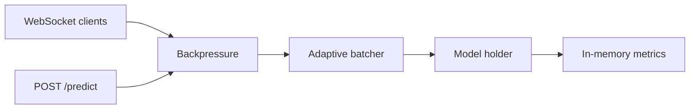

# StreamInfer

StreamInfer is a local inference-serving project for exploring adaptive batching,
backpressure, model hot-swap, and lightweight service metrics.

The project is intentionally small. It is not a replacement for Triton, Ray Serve, or
managed inference platforms. I use it to make serving patterns easier to inspect in plain
Python.

## What It Does

- **WebSocket streaming:** clients send JSON payloads and receive predictions.
- **HTTP prediction:** `/predict` uses the same batching path as streaming requests.
- **Adaptive batching:** requests flush when the batch is full or a timeout is reached.
- **Backpressure:** per-client rate limits and queue-depth checks protect the service.
- **Model hot-swap:** switch between simple demo models through an API call or SIGHUP.
- **Metrics:** in-memory counters are exposed at `/metrics`.

## Architecture



## Why Adaptive Batching Matters

Fixed batching creates a tradeoff: small batches keep latency low but waste throughput,
while large batches improve throughput but can hold requests too long. StreamInfer uses a
simple rule:

1. flush immediately when the batch reaches `STREAMINFER_BATCH_SIZE`
2. flush when `STREAMINFER_BATCH_TIMEOUT_MS` expires

That gives the service a visible place to reason about latency and throughput tradeoffs
without hiding the behavior behind a larger serving framework.

## Quick Start

```bash
git clone https://github.com/GoparapukethaN/streaminfer.git
cd streaminfer

python -m venv .venv
. .venv/bin/activate
pip install -e ".[dev]"

python -m streaminfer.server
```

In another terminal:

```bash
python examples/client.py
```

## Docker

```bash
docker build -t streaminfer .
docker run -p 8000:8000 streaminfer
```

## Configuration

All settings use environment variables with the `STREAMINFER_` prefix.

| Variable | Default | Description |
| -------- | ------- | ----------- |
| `STREAMINFER_BATCH_SIZE` | 16 | Max items per batch |
| `STREAMINFER_BATCH_TIMEOUT_MS` | 50 | Flush timeout in ms |
| `STREAMINFER_MAX_QUEUE_SIZE` | 1000 | Per-client queue limit |
| `STREAMINFER_RATE_LIMIT_RPS` | 100 | Requests per second per client |
| `STREAMINFER_MODEL_NAME` | echo | Model to load at startup |
| `STREAMINFER_PORT` | 8000 | Server port |

## API

| Endpoint | Method | Description |
| -------- | ------ | ----------- |
| `/ws` | WebSocket | Streaming inference |
| `/predict` | POST | Single request/response through the batcher |
| `/metrics` | GET | Service metrics as JSON |
| `/api/reload` | POST | Hot-swap demo model: `{"model": "upper"}` |
| `/health` | GET | Health check |

## Verification

```bash
python -m venv .venv
. .venv/bin/activate
pip install -e ".[dev]"
pytest tests -q
ruff check streaminfer tests
```

Current local verification: `24 passed` and `ruff` clean.

Live smoke test:

```bash
STREAMINFER_PORT=8010 python -m streaminfer.server
curl http://127.0.0.1:8010/health
curl -X POST http://127.0.0.1:8010/predict \
  -H 'Content-Type: application/json' \
  -d '{"text":"mlops"}'
curl -X POST http://127.0.0.1:8010/api/reload \
  -H 'Content-Type: application/json' \
  -d '{"model":"upper"}'
```

Current local smoke test: `/health`, `/predict`, `/api/reload`, and `/metrics` all
responded successfully.

## Limitations

- Demo models are intentionally simple.
- Metrics are in-memory and reset on restart.
- Hot-swap is useful for demonstrating the serving pattern, not a full rollout system.
- Load testing depends on the local machine and should be rerun before quoting numbers.

## License

MIT. See [LICENSE](LICENSE).
