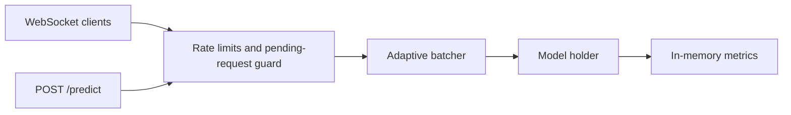

# StreamInfer

StreamInfer is a local inference-serving and benchmark project for exploring adaptive
batching, backpressure, model hot-swap, lightweight service metrics, and LLM-style
latency/throughput tradeoffs.

The project is intentionally small. It is not a replacement for Triton, Ray Serve, or
managed inference platforms. I use it to make serving patterns easier to inspect in plain
Python.

## What It Does

- **WebSocket request/response:** connected clients send JSON payloads and receive predictions.
- **HTTP prediction:** `/predict` uses the same batching path as WebSocket requests.
- **Adaptive batching:** requests flush when the batch is full or a timeout is reached.
- **Backpressure:** HTTP and WebSocket clients use per-client rate limits and
  pending-request checks before entering the batcher.
- **Model hot-swap:** switch between simple demo models through an API call or SIGHUP.
- **Metrics:** in-memory counters are exposed at `/metrics`.
- **Load-test reports:** local WebSocket load tests can write JSON latency/throughput
  artifacts.
- **Benchmark sweeps:** deterministic LLM-style profile compares batch size and timeout
  settings and writes JSON/Markdown reports.
- **Benchmark gates:** compare baseline/current sweep reports and fail on throughput,
  p95 latency, or error regressions.

## Architecture



## Why Adaptive Batching Matters

Fixed batching creates a tradeoff: small batches keep latency low but waste throughput,
while large batches improve throughput but can hold requests too long. StreamInfer uses a
simple rule:

1. flush immediately when the batch reaches `STREAMINFER_BATCH_SIZE`
2. flush when `STREAMINFER_BATCH_TIMEOUT_MS` expires

That gives the service a visible place to reason about latency and throughput tradeoffs
without hiding the behavior behind a larger serving framework.

## Quick Start

```bash
git clone https://github.com/GoparapukethaN/streaminfer.git
cd streaminfer

python -m venv .venv
. .venv/bin/activate
pip install -e ".[dev]"

python -m streaminfer.server
```

In another terminal:

```bash
python examples/client.py
```

## Docker

```bash
docker build -t streaminfer .
docker run -p 8000:8000 streaminfer
```

Repeatable container smoke check:

```bash
make docker-check
```

## Configuration

All settings use environment variables with the `STREAMINFER_` prefix.

| Variable | Default | Description |
| -------- | ------- | ----------- |
| `STREAMINFER_BATCH_SIZE` | 16 | Max items per batch |
| `STREAMINFER_BATCH_TIMEOUT_MS` | 50 | Flush timeout in ms |
| `STREAMINFER_MAX_QUEUE_SIZE` | 1000 | Per-client queue limit |
| `STREAMINFER_RATE_LIMIT_RPS` | 100 | Requests per second per client |
| `STREAMINFER_MODEL_NAME` | echo | Model to load at startup |
| `STREAMINFER_PORT` | 8000 | Server port |

## API

| Endpoint | Method | Description |
| -------- | ------ | ----------- |
| `/ws` | WebSocket | Streaming inference |
| `/predict` | POST | Single request/response through the batcher |
| `/metrics` | GET | Service metrics as JSON |
| `/api/reload` | POST | Hot-swap demo model: `{"model": "upper"}` |
| `/health` | GET | Health check |

## Verification

```bash
python -m venv .venv
. .venv/bin/activate
pip install -e ".[dev]"
make verify
```

Last local verification (2026-05-20): `40 passed`, `ruff` clean, and the live smoke
test passes.

Live smoke test:

```bash
PYTHON=.venv/bin/python ./scripts/smoke-local.sh
```

Local smoke test from 2026-05-20: `/health`, `/predict`, `/api/reload`, and `/metrics`
all responded successfully.

Docker smoke test from 2026-05-20: image build, container health check, `/health`,
`/predict`, `/api/reload`, and `/metrics` all passed through `make docker-check`.

The repeatable verification checklist is tracked in [docs/verification.md](docs/verification.md).

## Load Testing

```bash
python -m streaminfer.server
python examples/load_test.py --connections 10 --requests 20 --output artifacts/load-test.json
```

The JSON report captures configuration, successful request count, error count,
throughput, and p50/p95/p99 latency. See [docs/load-testing.md](docs/load-testing.md) for
the report shape and caveats.

Latest local load-report check: 20 WebSocket requests completed with `0` errors and a
JSON report written to `/tmp/streaminfer-load-test.json`. Rerun locally before quoting
latency numbers, since they depend on the machine and current settings.

## Inference Benchmark Sweep

```bash
python examples/sweep_benchmark.py \
  --batch-sizes 1,4,8 \
  --timeouts-ms 5,25 \
  --concurrency 8 \
  --output-json docs/sample-inference-sweep.json \
  --output-md docs/sample-inference-sweep.md
```

The sweep uses the built-in `synthetic-llm` profile, so it runs without API keys, GPUs, or
model downloads. It is useful for comparing local serving configuration tradeoffs and for
catching regressions in batching behavior. See
[docs/inference-benchmarking.md](docs/inference-benchmarking.md) and the current
[sample report](docs/sample-inference-sweep.md).

To compare a new run against a baseline:

```bash
python examples/sweep_benchmark.py \
  --batch-sizes 1,4,8 \
  --timeouts-ms 5,25 \
  --concurrency 8 \
  --baseline-json docs/sample-inference-sweep.json \
  --output-json artifacts/inference-sweep.json \
  --output-md artifacts/inference-sweep.md \
  --gate-json artifacts/inference-gate.json \
  --gate-md artifacts/inference-gate.md
```

The gate writes Markdown/JSON artifacts and exits nonzero when throughput drops more
than `10%`, p95 latency increases more than `20%`, or current sweep errors exceed `0`.
See the tracked [sample gate](docs/sample-inference-gate.md).

## Limitations

- Demo models are intentionally simple.
- The benchmark sweep uses a deterministic synthetic model profile; it is not a substitute
  for benchmarking a specific production model or GPU.
- Metrics are in-memory and reset on restart.
- Hot-swap is useful for demonstrating the serving pattern, not a full rollout system.
- Load testing depends on the local machine and should be rerun before quoting numbers.

## License

MIT. See [LICENSE](LICENSE).
